# Routing Flows: .opencode/

## Source Files Inventory

Scanned source path: `.opencode/` (no `-f` argument provided, defaulted to entire directory)

### Commands (5 files)

| File | Description |
|------|-------------|
| `commands/commit-changes.md` | Stage changes and create commit with formatted message |
| `commands/discover-requirements.md` | Initiate requirements discovery from user request |
| `commands/learn-skill-from-session.md` | Derive reusable artifact candidate from session evidence |
| `commands/promote-skill-candidate.md` | Promote staged candidate to stable location |
| `commands/update-routing-docs.md` | Create or update routing documentation |

### Workflows (2 files)

| File | Description |
|------|-------------|
| `workflows/discover-requirements-core.md` | Transform user request into plan-ready proposed units |
| `workflows/learn-skill-from-session.md` | Orchestrate artifact derivation from session evidence |

### Rules (14 files)

| File | Description |
|------|-------------|
| `rules/agent-output.md` | Agent output formatting constraints |
| `rules/coding-style.md` | Code style and formatting standards |
| `rules/context7.md` | Context management rules |
| `rules/discover-requirements-core-contract.md` | Contract for discovery output structure |
| `rules/discovery-analysis-style.md` | Analysis style guidelines for discovery |
| `rules/entrypoint-compatibility.md` | Command entrypoint stability requirements |
| `rules/graph-routing-docs.md` | Mermaid flowchart requirements for routing docs |
| `rules/learn-skill-from-session/01-pattern-extraction.md` | Pattern extraction from session evidence |
| `rules/learn-skill-from-session/02-worthiness-check.md` | Candidate worthiness evaluation criteria |
| `rules/learn-skill-from-session/03-synthesize-package.md` | Candidate package synthesis rules |
| `rules/learn-skill-from-session/candidate-rule.md` | Candidate formation constraints |
| `rules/learn-skill-from-session/promotion-rule.md` | Promotion to stable location rules |
| `rules/learn-skill-from-session/user-alignment-gate.md` | User approval gate requirements |
| `rules/token-efficient-workflow.md` | Token efficiency guidelines |

### Skills (3 files)

| File | Description |
|------|-------------|
| `skills/code-review-expert/SKILL.md` | Code review with senior engineer lens |
| `skills/fix-bugs/SKILL.md` | Diagnose and fix bugs with minimal changes |
| `skills/simplify-code/SKILL.md` | Simplify recently written or heavily changed code |

---

## Command Routing Diagrams

### commit-changes.md

Arguments (`$1` scope, `$2` issue key) → Validate scope (staged|all) → Stage changes conditionally → Generate message → Commit → Output result

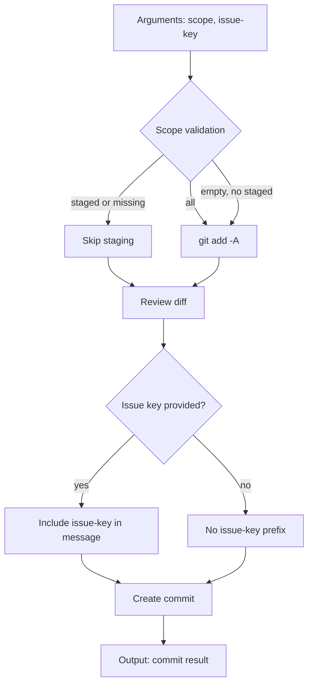

**Stop conditions:**
- No changes to commit (unstaged and staged both empty)
- Git operation fails

**Routing standards:**
- Default scope is `staged`, not `all`
- Issue key is optional, never inferred
- Message length must be <= 72 characters

---

### discover-requirements.md

User request → Validate input → Invoke `discover-requirements-core` workflow → Return structured result

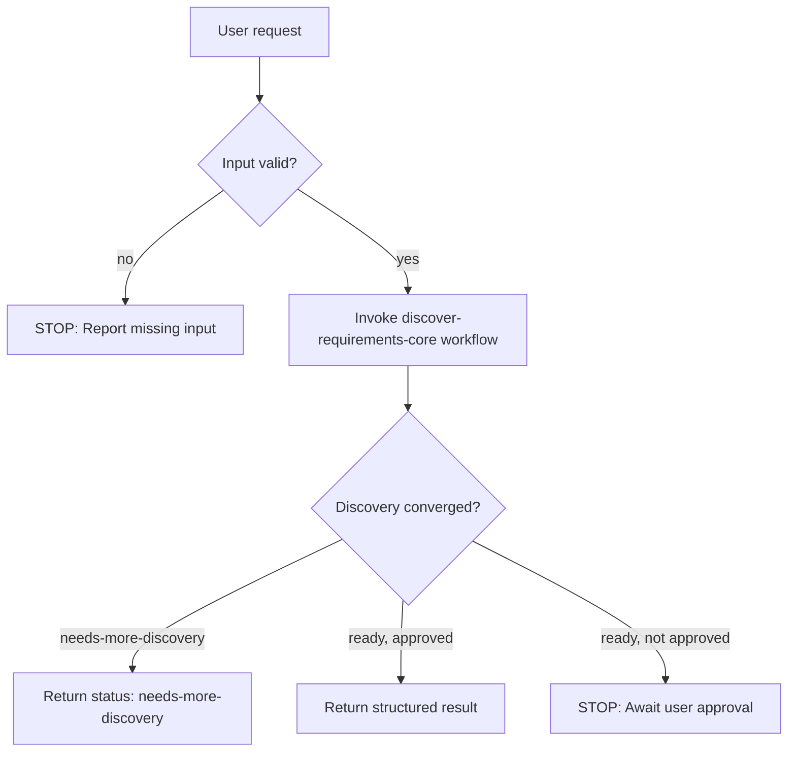

**Stop conditions:**
- Missing or invalid user input
- User does not explicitly approve persistence
- Discovery has not converged (blocking questions unresolved)

**Routing standards:**
- Delegates all discovery logic to `discover-requirements-core` workflow
- Command layer only handles input validation and result return
- No persistence occurs without explicit user approval

---

### learn-skill-from-session.md

Arguments (`$1` session link, `$2...` goal) → Validate both required → Invoke `learn-skill-from-session` workflow → Stage candidate → Return summary

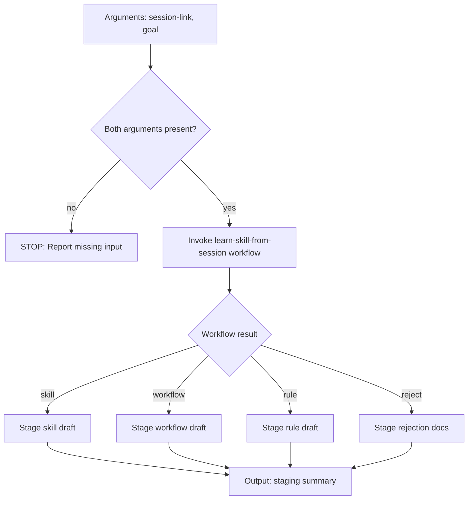

**Stop conditions:**
- Session link cannot be fetched
- Source session lacks usable evidence
- User does not give explicit approval
- No reusable pattern is strong enough

**Routing standards:**
- Staging-only command; must not install to stable locations
- Outputs to `.temp/reusable-artifact-candidates/current/`
- Final type is exactly one of: skill, workflow, rule, reject

---

### promote-skill-candidate.md

Candidate path → Validate candidate exists → Apply promotion rules → Install to stable location → Confirm

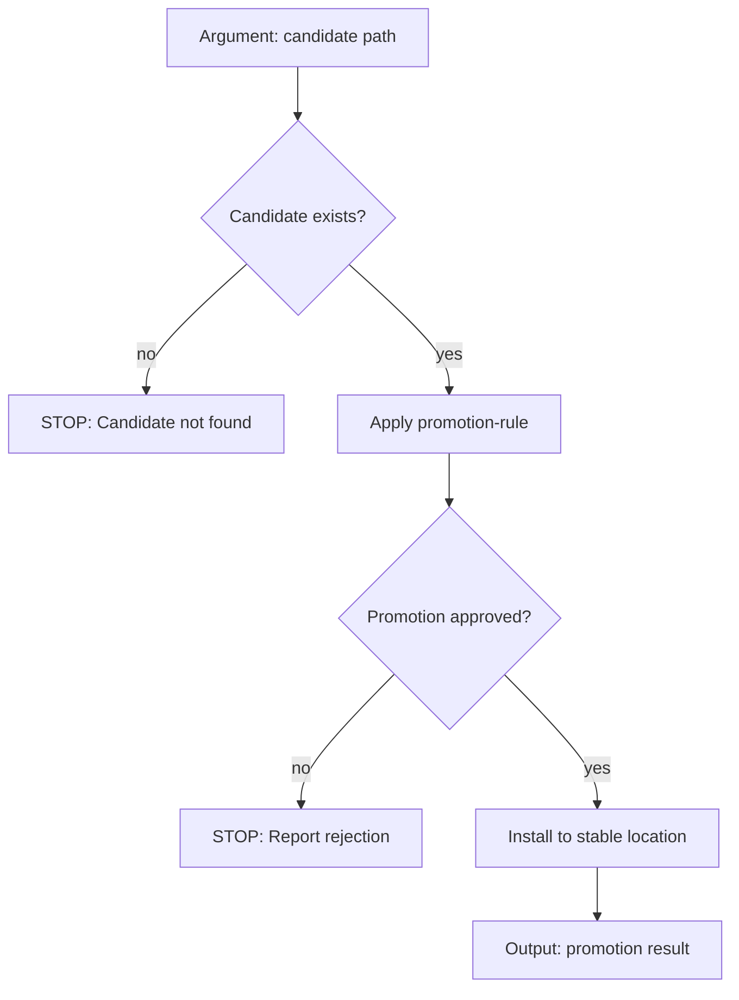

**Stop conditions:**
- Candidate path does not exist or is invalid
- Promotion rule rejects the candidate
- Target stable location already contains conflicting artifact

**Routing standards:**
- Requires explicit promotion approval via promotion-rule
- Validates against existing artifacts before install

---

### update-routing-docs.md

Target doc path → Validate/resolve path → Parse `-f` source paths → Scan files → Generate/update routing doc

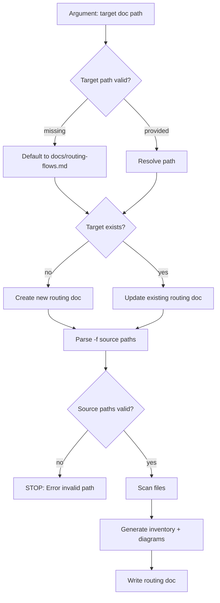

**Stop conditions:**
- Source path provided with `-f` does not exist
- Target path format is invalid
- No source files found to process

**Routing standards:**
- Default source path is `.opencode/` when no `-f` argument provided
- Diagrams sized to layer boundary (command stops at workflow handoff)
- Routing standards section always included

---

## Workflow Routing Diagrams

### discover-requirements-core.md

12-stage pipeline with planning readiness and approval gates

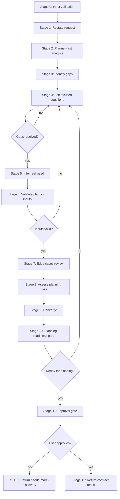

**Stop conditions:**
- User does not explicitly approve (Stage 11)
- Planning readiness gate fails (Stage 10)
- Blocking questions cannot be resolved

**Downstream handoffs:**
- Rules: `discovery-analysis-style.md`, `discover-requirements-core-contract.md`
- Output: Structured contract result (neutral, no file writes)

**Routing standards:**
- Questions limited to 3-6 per round
- Prefer A/B or contrast questions
- Surface all blocking questions before returning `ready`
- Silence or implied agreement is not approval

---

### learn-skill-from-session.md

10-stage orchestration with evidence collection, pattern extraction, and user alignment gate

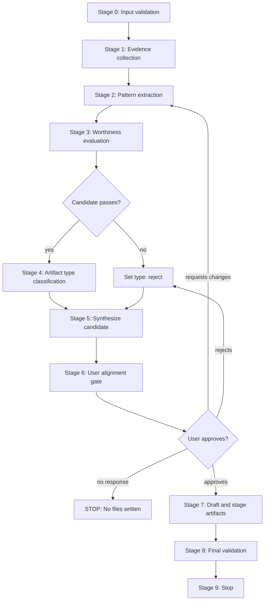

**Stop conditions:**
- Source session link cannot be fetched (Stage 0)
- No reusable pattern strong enough (Stage 3 → reject)
- User does not give explicit response (Stage 6 → STOP)
- User requests changes (Stage 6 → return to Stage 2)

**Downstream handoffs:**
- Rules: `candidate-rule.md`, `promotion-rule.md`, `user-alignment-gate.md`, `01-pattern-extraction.md`, `02-worthiness-check.md`, `03-synthesize-package.md`
- Output: Staged files in `.temp/reusable-artifact-candidates/current/`

**Routing standards:**
- Prefer precision over completeness
- Prefer reject over weak artifact
- Prefer rule over fake skill
- Default to no installation
- Stage 6 requires explicit approval; silence is not consent

---

## Rule Routing Diagrams

### graph-routing-docs.md

Must/Must Not logic for when and how to include Mermaid flowcharts

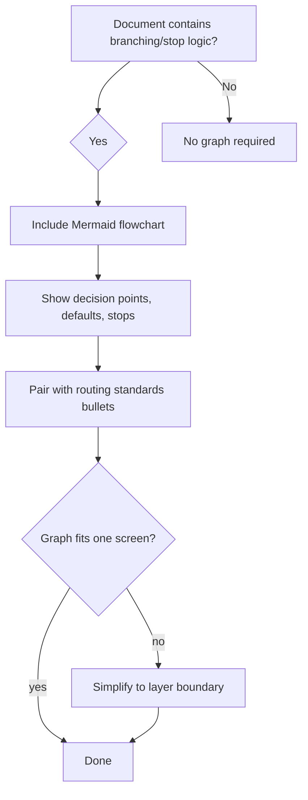

**Must:**
- Include Mermaid flowchart when doc contains branching or stop logic
- Use concise, action-oriented node labels
- Show decision points, default paths, and stop conditions explicitly
- Pair graph with routing standards bullets
- Keep graph narrow enough to fit on one screen

**Must Not:**
- Use graphs as decoration without decision clarity
- Hide argument validation, ambiguity handling, or stop conditions in prose only
- Mix unrelated flows into one diagram
- Add graph requirements to simple single-path docs

---

### learn-skill-from-session/* (Rules Bundle)

Collection of rules governing artifact derivation lifecycle

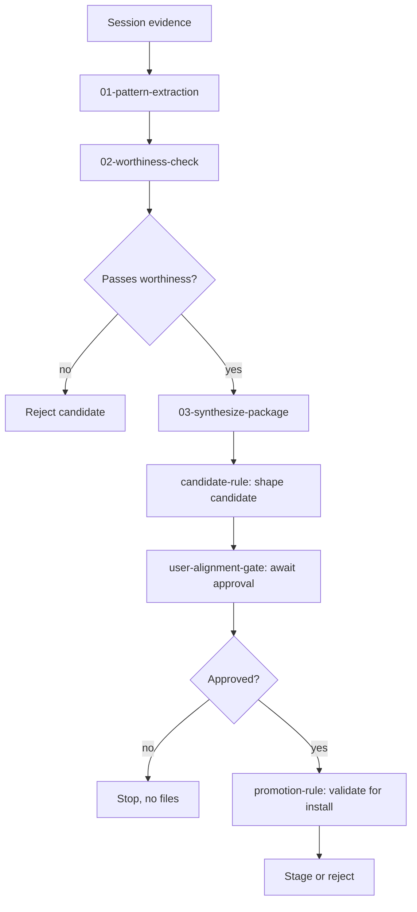

**Stop conditions:**
- Pattern not extractable from evidence
- Candidate fails worthiness check
- User does not approve alignment
- Promotion rule rejects candidate

---

## Skill Routing Diagrams

### fix-bugs

When to use → Reproduce → Inspect → Fix → Verify → Report

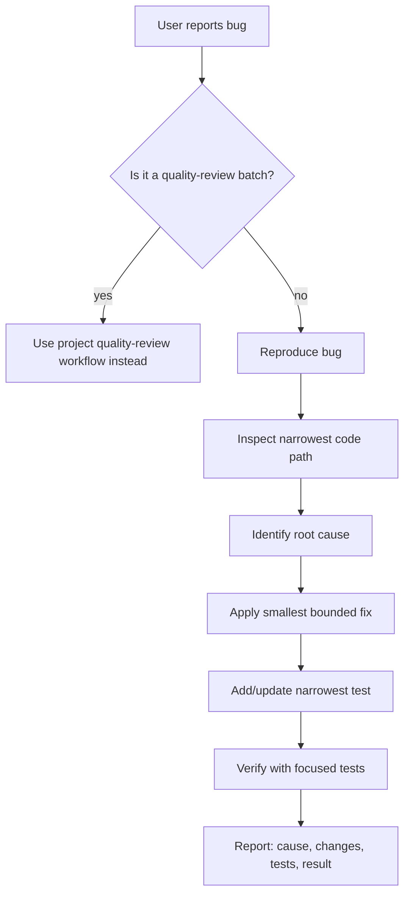

**Bounds:**
- Crash reports, incorrect behavior, failing tests, regressions
- Not for: review-batch-only fixes, broad refactors, cleanup, feature work

**Guardrails:**
- Prefer guard clauses and local fixes
- Avoid unrelated refactors
- Do not change behavior not justified by bug report

---

### simplify-code

When to use → Identify complexity → Apply simplification → Verify behavior → Report

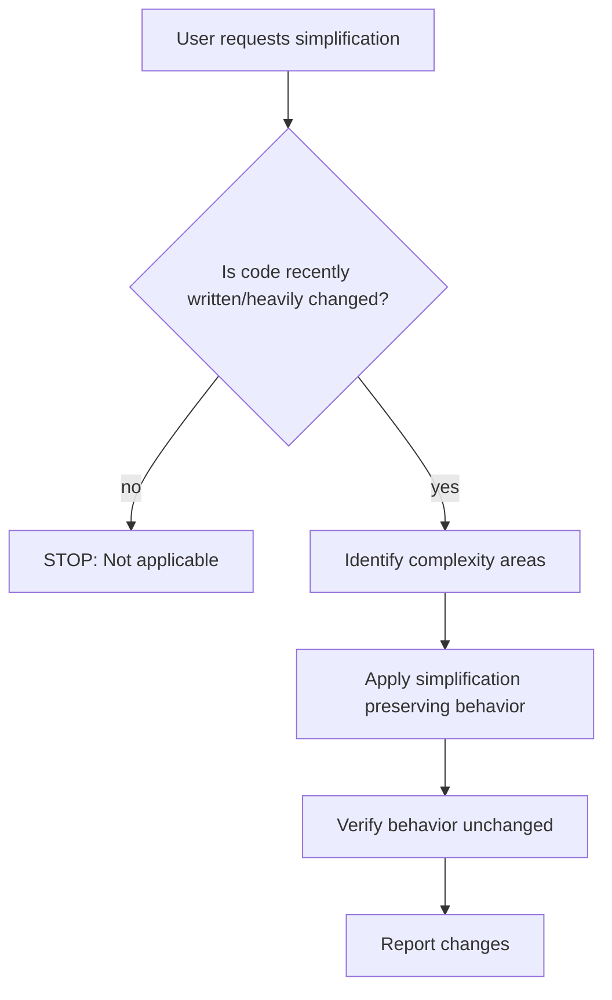

**Bounds:**
- Recently written code, heavily changed code, post-refactor cleanup
- Not for: prompt or instruction-file editing

---

### code-review-expert

When to use → Analyze changes → Detect issues → Report findings

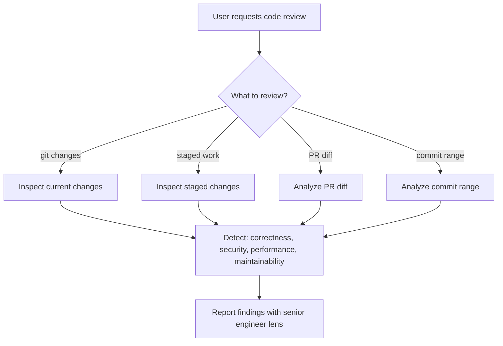

**Bounds:**
- Current git changes, staged work, PR diffs, commit ranges
- Detects: correctness bugs, architecture drift, security risks, performance regressions, maintainability issues

---

## Routing Standards

### Layer Boundaries

| Layer | Shows | Stops At |
|-------|-------|----------|
| Command | Arguments → Validation → Workflow selection → Output | Workflow handoff |
| Workflow | Stage flow → Decision points → Handoffs | Skill/rule handoff |
| Skill | When to use → Bounds → Own decisions | Internal implementation |
| Rule | Must/Must Not logic → Acceptance checks | Downstream enforcement |

### Diagram Rules

1. **One clear handoff graph over nested detail graphs**
2. **Command diagrams stop at workflow handoff** - do not expand workflow internals
3. **Workflow diagrams stop at skill/rule handoff** - do not expand skill/rule internals
4. **Stop conditions must be visible** in every diagram
5. **Decision points must be explicit** with clear yes/no branches
6. **Graphs sized to fit one screen when possible**

### Validation Checklist

- [ ] Source files inventory is accurate and complete
- [ ] Each file has a routing diagram sized to its layer boundary
- [ ] Command diagrams show only argument routing and workflow selection
- [ ] Workflow diagrams show only stage flow and downstream handoffs
- [ ] Skill diagrams show only when-to-use, bounds, and own decisions
- [ ] Rule diagrams show only must/must not logic and acceptance checks
- [ ] Stop conditions are visible in all diagrams
- [ ] Decision points have explicit yes/no branches
- [ ] Routing standards section is present and explicit
- [ ] Mermaid syntax is valid and renderable

---

## Summary

- **Source paths scanned:** 1 (`.opencode/`)
- **Source files processed:** 24
  - Commands: 5
  - Workflows: 2
  - Rules: 14
  - Skills: 3
- **Action taken:** created
- **Diagrams added:** 12 (one per significant routing file, grouped where appropriate)
- **Layer boundaries enforced:** Yes
- **Stop conditions made explicit:** Yes
- **Routing standards included:** Yes
